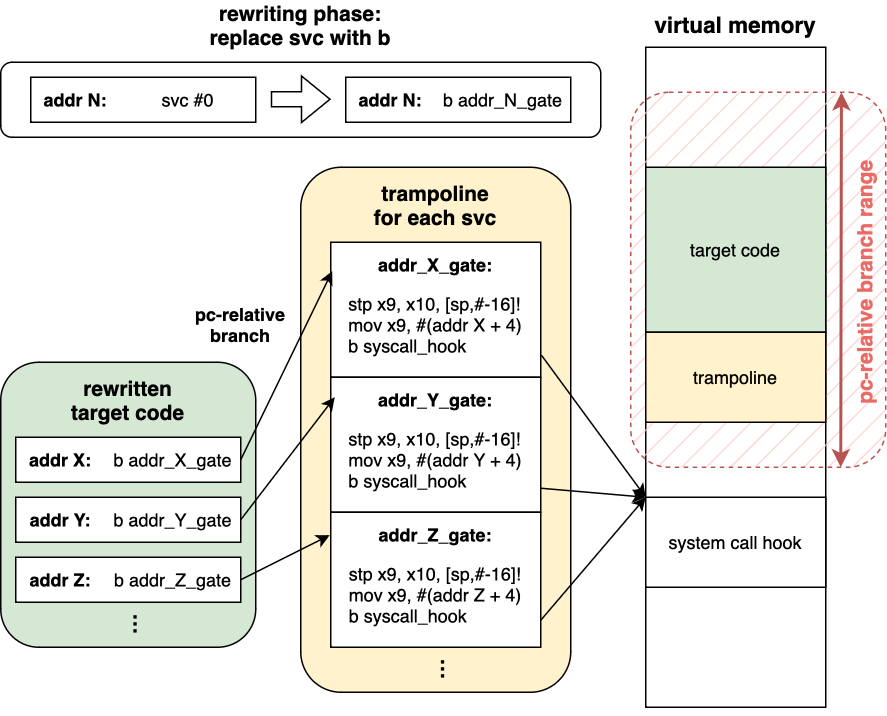

# svc-hook: System Call Hook for ARM64

svc-hook is a system call hook mechanism for ARM64, achieving speeds about **2,000 times** faster than ptrace. It utilizes binary rewriting, replacing every `svc` instruction with a `b` instruction in the loaded target binary code before the main function starts.

Inspired by [zpoline](https://github.com/yasukata/zpoline) for x86_64 Linux, svc-hook adapts its concepts for ARM64, offering significant speed and coverage advantages without the need for target source code or kernel feature dependencies.

## Key Features

- Performance: 2,000 times faster than ptrace
- Independence: No need for target source code
- Simplicity: Works without relying on kernel features

Read [my blog post]() for more details.

## Target Platform

svc-hook supports ARM64 Linux.

## Build

svc-hook has no external dependencies.
To build `libsvchook.so`, run the following command in the root directory:

```shell
make
```

To build a simple hook application `libsvchook_basic.so`, use:

```shell
make -C apps/basic
```

## Usage

You need to set two environment variables:

- `LIBSVCHOOK`: Path to the hook application e.g., `apps/basic/libsvchook_basic.so`
- `LD_PRELOAD`: Path to `libsvchook.so`

### Example

```shell
LIBSVCHOOK=./apps/basic/libsvchook_basic.so LD_PRELOAD=./libsvchook.so [target]
```

Replace `[target]` with the binary you wish.

## How does it work

svc-hook has three stages during initialization:

1. It records the addresses of `svc` instructions in the target code and computes the range a `b` instruction can branch to (from `pc - 0x8000000` to `pc + 0x7fffffc`).
2. A custom trampoline is set within the calculated range.
3. The target code is rewritten accordingly.

### Overview Diagram



## License

svc-hook is released under the Apache license version 2.0.
